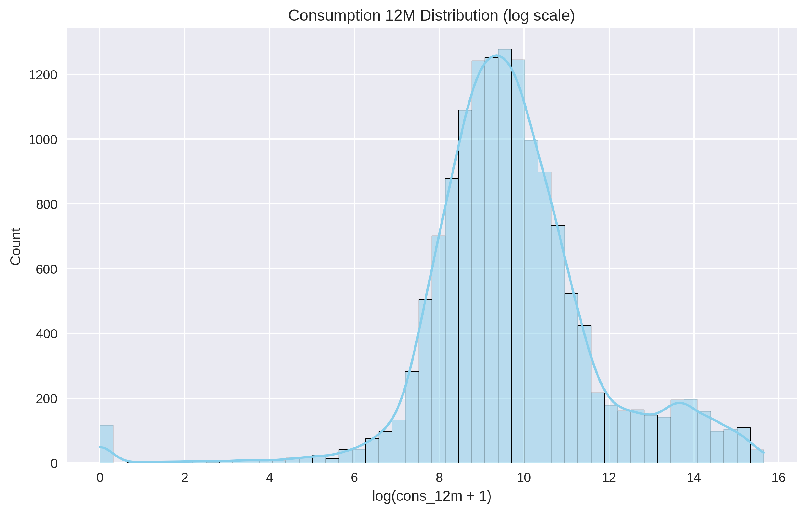
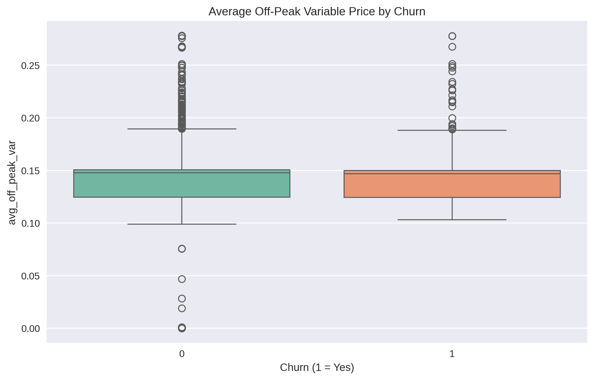
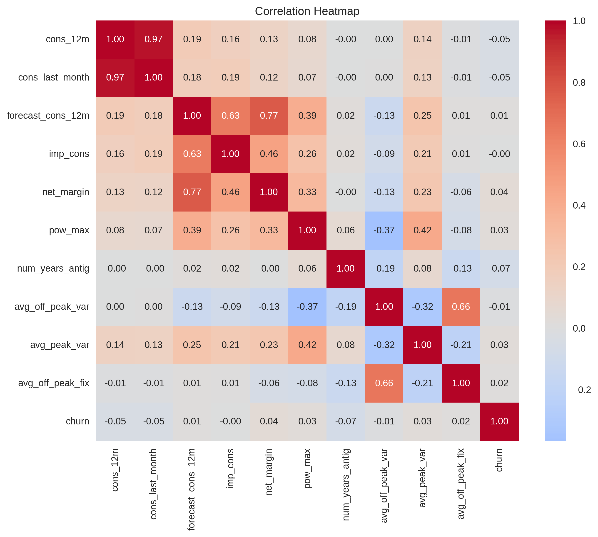
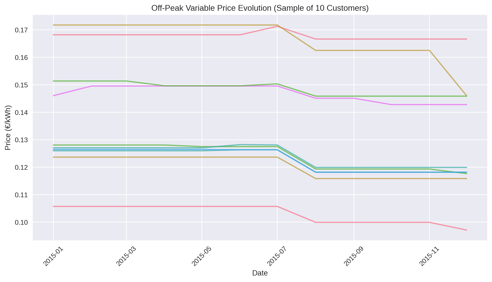
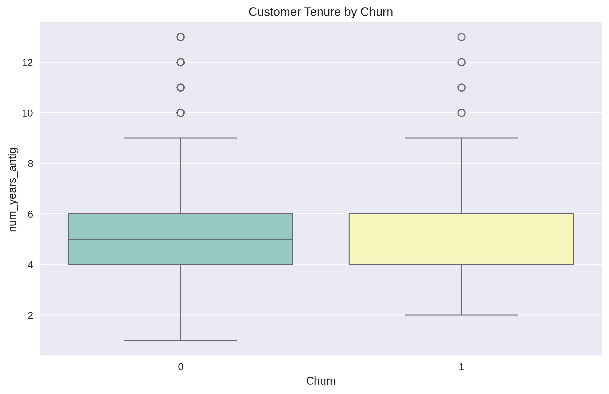

# BCG PowerCo – Customer Churn Analysis  
**Exploratory Data Analysis | Python | Pandas | Seaborn**

**Candidate:** Hlangalezwe Zulu

**Date:** November 2025  

---

### Key Business Insights

| Metric                          | Value             | Insight                                                                 |
|---------------------------------|-------------------|-------------------------------------------------------------------------|
| Total Customers                 | 14,606            | —                                                                       |
| **Overall Churn Rate**          | **9.72%**         | Highly imbalanced → use class weighting / SMOTE                        |
| Electricity-only customers      | 81.8%             | Gas contracts are a small minority                                      |
| Average customer tenure         | 5.0 years         | Long-term, stable customer base                                         |
| Price changes in 2015           | Multiple jumps    | Strong signal for price-sensitivity features                           |

---

### Key Visualizations

| Annual Consumption Distribution (log scale)              | Off-Peak Price vs Churn                              |
|-----------------------------------------------------------|-------------------------------------------------------|
|              |                  |

| Correlation Heatmap of Key Features                       | Price Evolution Over Time (Sample)                    |
|-----------------------------------------------------------|-------------------------------------------------------|
|                        |                      |

| Customer Tenure by Churn                                  |
|-----------------------------------------------------------|
|                             |

---

### Notebook
Full analysis with code, cleaning, and explanations:  
[bcg x Churn.ipynb](bcg%20x%20Churn.ipynb)

---

### Next Steps (Modeling)
- Log-transform skewed features  
- Engineer price-sensitivity features (6-month % change, max jump)  
- Train XGBoost / LightGBM with class weights  

 
Feel free to star or fork!

---
